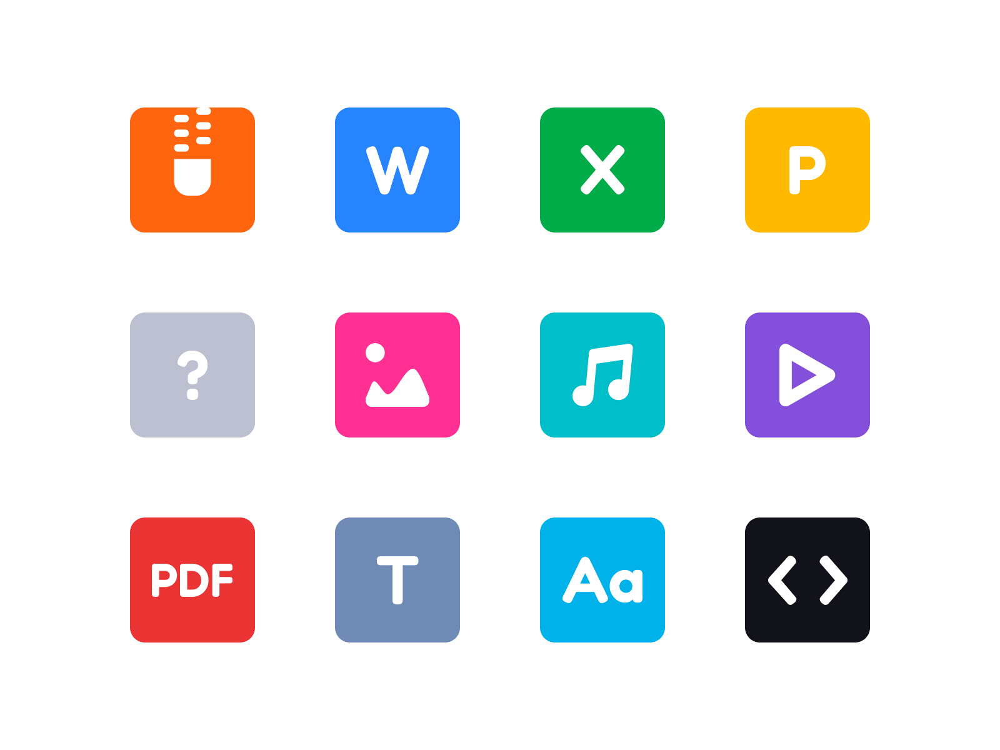

# File Icons

An Icon Font for File Types

## Resources

* [Figma Prototype](https://www.figma.com/community/file/1173094923799177815)
* [Figma file](./assets/figma/fileicons.fig)
* [Font files](./assets/fonts/fileicon/)
* [CSS Fontface](./assets/fonts/fileicon/mcfileicon.fontface.css)
* [SVG Files](./assets/vectors/)
